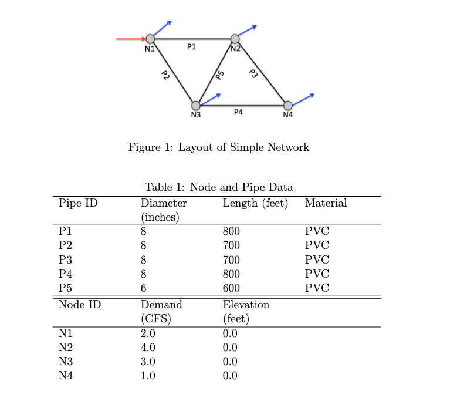

# ES-7

## Purpose:

- Compute flow distribution in pipeline networks. 
- Introduction to use of professional software (EPANET)
- Develop expertise in interpreting output to answer specific hydraulic questions

## Background

Figure  1  is  a  five-pipe  network  with  a  water  supply  source  (a  reservoir,  not  shown) connected at Node 1, and demands at Nodes 1-5.  
Table 1 is a list of the relevant pipe and node data.

---
## Exercise 1

Build an EPANET model, using the Hazen-Williams head loss model of the network. From your preparation, or the completed model:

a)  Write the node equations of continuity for Nodes 1-4.

b)  Write the head loss equations for each of the pipes in the system.

c)  Make a screen capture of the EPANET program showing your network map, with the Node ID and Node Pressures displayed on the map, and with the Pipe ID and Pipe Flow Rates on the map.

---
## Exercise 2

a)  Make a table that lists each node name, node elevation, and the resultant pressurein U.S. Customary units.

b)  Make a table that lists each pipe name,  length,  diameter,  Hazen-Williams coefficient, and the resultant flow rate in U.S. Customary units.

c)  Determine the flow rate in each pipe of the network, for the case where the total head at Node 1 is 100 feet.

d)  Determine the Darcy-Weisbach friction factor in each pipe of the network.

e)  Using the results of your flow distribution, determine the head loss from Node 1 to Node 4.

f)  Determine the head at Node 4

g)  Identify the node with the lowest **pressure** in your solution.

## Deliverables:
A memorandum-type report with your solution, showing the requested equations, screen captures, tables and head loss calculations.

## References
1. Rossman,  L.  (2000).   EPANET  2  users  manual.   Technical  Report  EPA/600/R-00/057,U.S. Environmental Protection Agency, National Risk Management Research LaboratoryCincinnati, OH 45268.

2. 
  EZ Button Sample .net file 

3. 
  EZ Button Solution Sketch 

