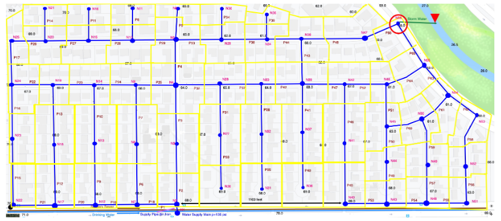

# ES-13

## Purpose:
Design and analyze a storm drain system for a small watershed.  

## Background

Figure 1 is a Somewhere USA from earlier in the course  

||||
|---|---|---|

||Figure 1. Somewhere USA Study Area||
|---|---|---|
||Image file @[https://3.137.111.182/ce-3372-webbook/exercise13/BasemapUSA.png](https://3.137.111.182/ce-3372-webbook/exercise13/BasemapUSA.png)||
||Image file without water pipes and yellow polygons @[https://3.137.111.182/ce-3372-webbook/exercise13/SomewhereUSABaseMap.png](https://3.137.111.182/ce-3372-webbook/exercise13/SomewhereUSABaseMap.png)||


---
## Exercise

Design  a  storm  sewer  system  that takes drainage from the study area and discharges into the stream in the upper right corner of the drawing (red circle).  Use Houston IDM criteria.  The storm sewer will have inlets and conduits, which run in the streets (underneath the streets of course).

- Apply  the  rational  design  method  to  size  the  conduits  for  a  5-year  storm,  for Harris County, Texas.

- Specify the invert (flow line) elevations of the nodes (inlets and junction boxes).

- Specify the soffit (crown) elevations for the pipes at each node.

- Construct and run a SWMM model of your drainage system,  and demonstrate that the system can convey the 5-year, 3-hour storm to the outfall without surcharge in the system

## Deliverables:

Submit a technical memorandum with screen captures of the relevant components above. Include a description of how the results were obtained and a discussion and interpretation of the results.  Show representative calculations where appropriate.  

## References


```python

```
