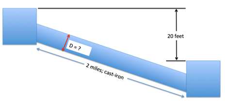
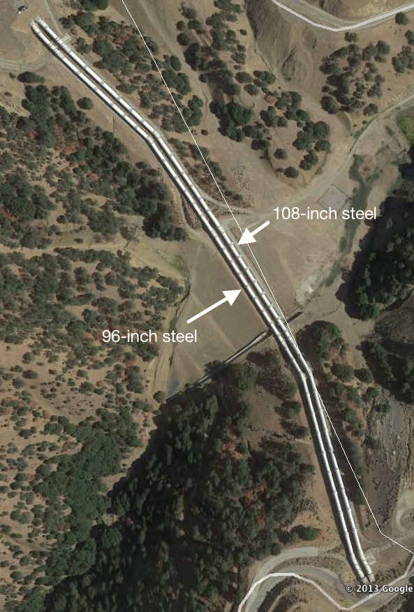

# ES-4

## Purpose:
Demonstrate application of head loss models in analysis of pressure and flow in water distribution systems.

## Background
Equation 1 below is the Hazen-Williams discharge formula in US Customary Units.

$$ Q=1.318~C_h~A~R^{0.63}~S^{0.54}~~~~~[1]$$

where;
- $Q$ is the discharge in $\frac{ft^3}{sec}$;
- $A$ is the cross section area of pipe in $ft^2$;
- $D$ is the pipe diameter.;
- $C_h$ is the Hazen-Williams friction coefficient (depends on pipe roughness);
- $R$ is the hydraulic radius in $ft$; and
- $S$ is the slope of the energy grade line ($\frac{h_f}{L}$); $L$ is the length of pipe.

Equation 2 below is the Hazen-Williams discharge formula in SI Units.

$$ Q=0.849~C_h~A~R^{0.63}~S^{0.54}~~~~~[2]$$

where;
- $Q$ is the discharge in $\frac{m^3}{sec}$;
- $A$ is the cross section area of pipe in $m^2$;
- $D$ is the pipe diameter.;
- $C_h$ is the Hazen-Williams friction coefficient (depends on pipe roughness);
- $R$ is the hydraulic radius in $m$; and
- $S$ is the slope of the energy grade line ($\frac{h_f}{L}$); $L$ is the length of pipe.

Equation 3 below is a formula to estimate the required pipe diameter for a particular dis-charge, head loss, and roughness (Swamee and Jain, 1976).

$$D= 0.66[k^{1.25}_s \times (\frac{LQ^2}{gh_f})^{4.75} + \nu Q^{9.4} \times (\frac{L}{gh_f})^{5.2}]^{0.04} ~~~~~[3]$$

where;
- $D$ is the pipe diameter;
- $k_s$ is the pipe roughness height;
- $L$ is the length of pipe;
- $g$ is the gravitational acceleration constant;
- $Q$ is the discharge in $L^3/T$;
- $h_f$ is the head loss in the pipe;
- $\nu$ is the viscosity of liquid in the pipe;

---
## Exercise 1

a) Look up the Hazen-Williams loss coefficient ($C_h$) for enamel coated, steel pipe and cite your data source.  
   
b) Estimate the head loss in a 10,000 foot length of 5-foot diameter, enamel coated steel pipe that carries carries 60$^o$F water at a discharge of 295 cubic-feet per second(cfs), using the appropriate Hazen-Williams head loss model.

---
## Exercise 2
a) Look up the Hazen-Williams loss coefficient ($C_h$) for Acrylonite Butadiene Styrene(ABS) pipe and cite your data source.

b) Estimate the head loss in a 3,050 meter length of 1.5-meter diameter, ABS pipethat carries carries 20$^o$C water at a discharge of 8.35 cubic-meters per second (cms),using the appropriate Hazen-Williams head loss model.

---
## Exercise 3

a) Find the viscosity for water at 60$^o$F. Cite the source of your value.

b)  Find the sand roughness height of cast-iron pipe.  Cite the source of your value.

c)  Use the Swamee and Jain (1976) equation to estimate the diameter of a cast-iron pipe  needed to carry 60$^o$F water at a discharge of  10  cubic-feet per  second  (CFS)  between  two  reservoirs  2  miles  apart  with  an elevation difference between the water surfaces in the two reservoirs of 20 feet as depicted in Figure 1 below.

 
||Figure 1. Pipeline connecting two reservoirs ||
|---|---|---|

---
## Exercise 4
Figure 2 is an aerial image of a parallel pipeline system in California.

||Figure 2. Parallel Pipeline System ||
|---|---|---|

The left pipeline is a 96-inch diameter steel pipe, whereas the right pipeline is a 108-inch diameter steel pipe.  Water at 50$^o$F has kinematic viscosity of $1.45 \times 10^{−5}~ft^2/s$. The  sand  roughness  of  ductile  iron  is  $1.64 \times 10^{-4}$ ft.   If  the  head  difference  for  the one-mile long pipelines between the thrust blocks is 120 feet, determine the discharge in the 96-inch diameter pipe in cubic-feet-per-second.
## Deliverables:
A 1-2 page memorandum-type report with your solutions, showing the arithmetic used and listing data sources employed.

## References
1. Swamee and Jain, A. K., 1976. Explicit equations for pipe-flow problems. ASCE J. of Hyd.Div., 102(HY5) pp. 657-664

